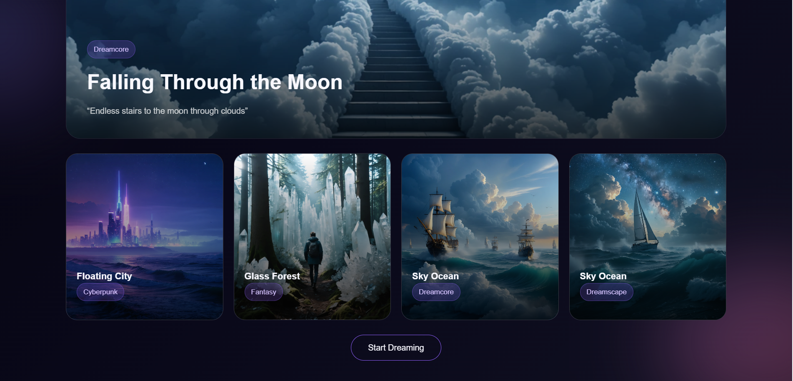
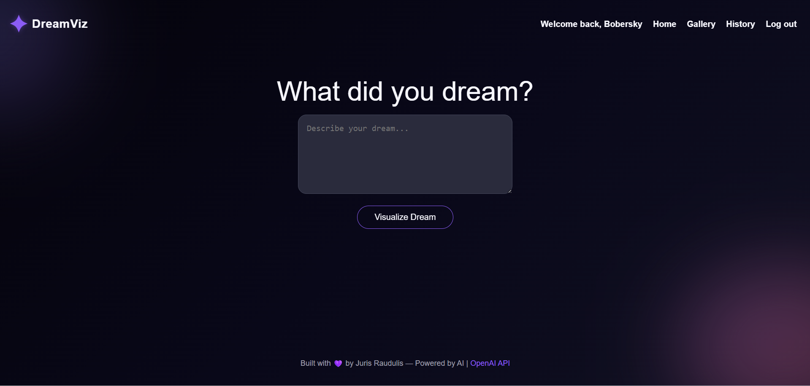
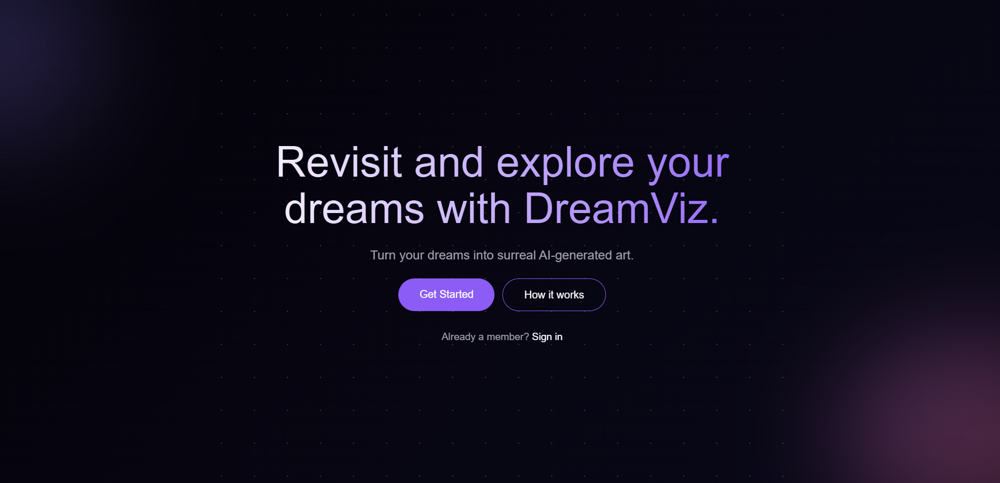

# DreamViz

 [Live Demo](https://dreamviz.netlify.app)

 
 
 

DreamViz is a full-stack web application that lets users generate, download, and share AI images from text prompts. Built with React, Node.js, Express, and PostgreSQL, DreamViz demonstrates secure authentication, usage tracking, and AI integration using the OpenAI API.

## Features
- User authentication & protected routes (JWT)
- AI image generation from prompts via OpenAI API
- Generation history
- Download & share images
- Backend-enforced usage limits
- Smooth UX with error and loading state handling

## Tech Stack
- Frontend: React
- Backend: Node.js, Express
- Database: PostgreSQL
- Testing: Jest
- Auth: Bcrypt, JWT
- AI: OpenAI API

## Running Locally

1. Clone the repo and install frontend dependencies
   git clone https://github.com/jraudulis/dreamviz
   cd dreamviz
   npm install

2. Install backend dependencies
   cd server
   npm install

3. Create a .env file in /server with:
   DATABASE_URL=
   JWT_SECRET=
   OPENAI_API_KEY=

4. Run frontend
   cd .. && npm run dev

5. Run backend
   cd server && npm run dev

## Some of the challanges and solutions
- API usage limits: Implemented backend rate limiting per user using JWT authentication and tracking database data.

- Error handling & loading states: Built a centralized system by using REACT state hook to handle errors and loading states across the app, providing a smooth and reliable user experience.

- User authentication & security: Developed secure signup/login flows with Bcrypt, JWT, protecting routes and user data from unauthorized access.

- Databse: Set up PostgreSQL with Knex migrations. Stores user-generated image history, enabling viewing, downloading, and sharing past creations.

- Variables and sensitive data: Used .env variables for all sensitive data (API keys, JWT secret, DB credentials). Configured separate development and production environments

